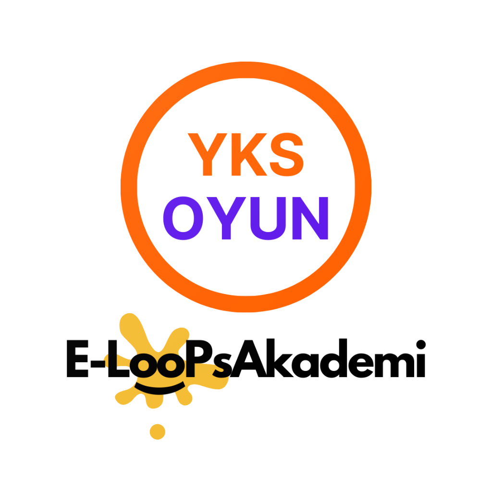
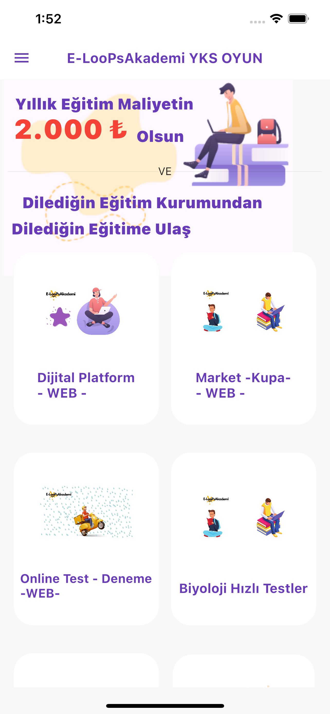
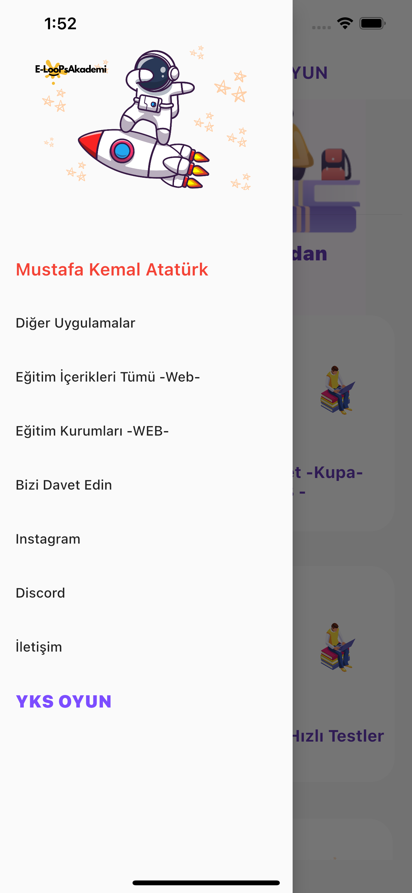
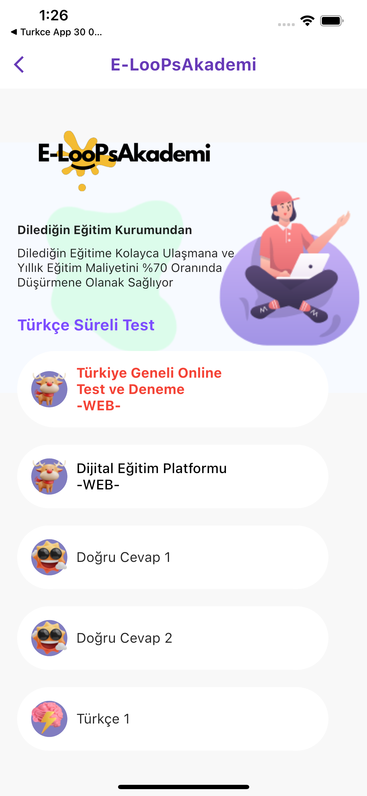
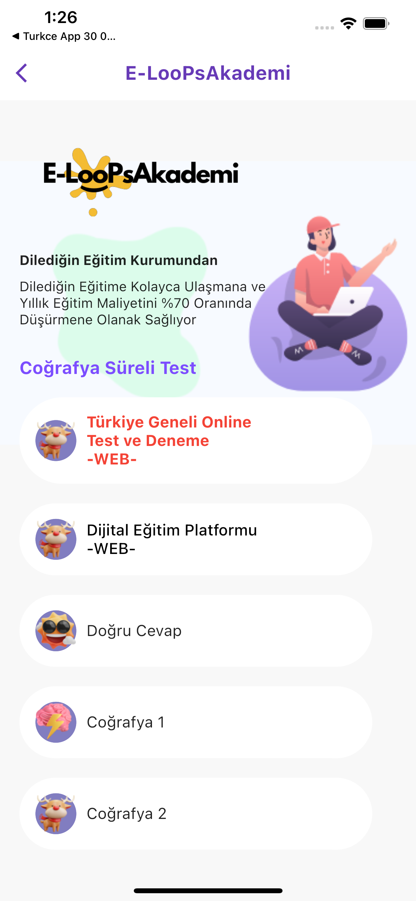
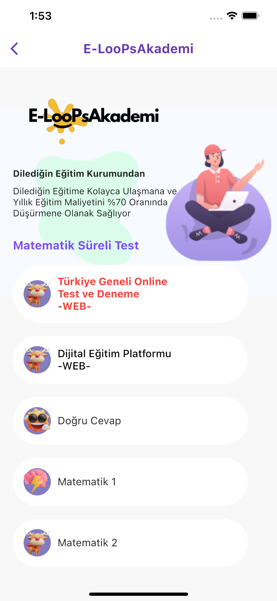
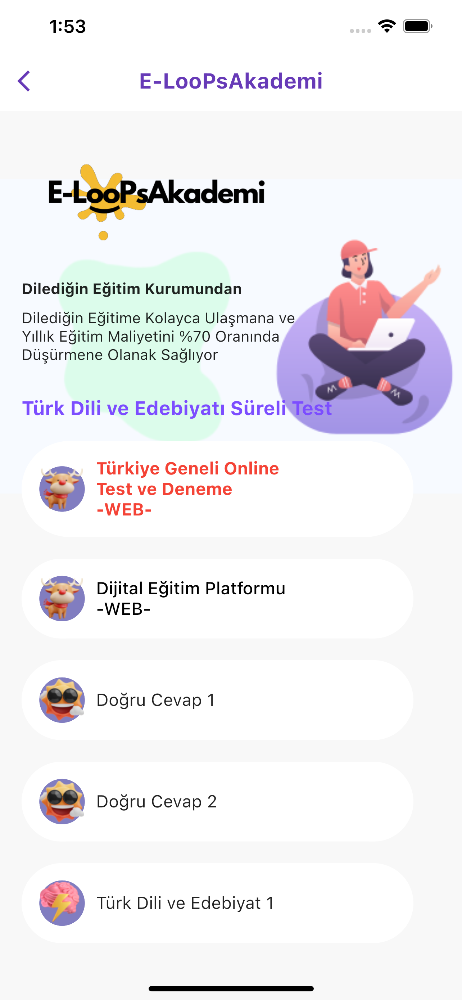
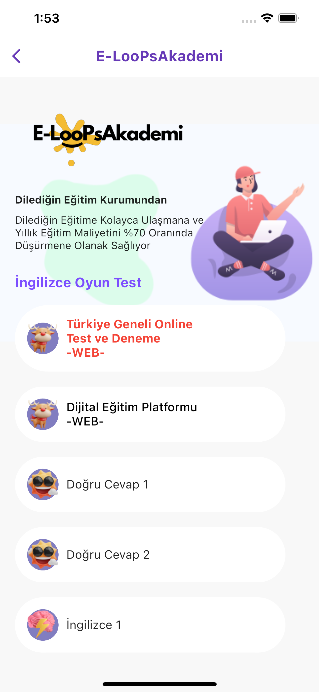

# YKS Oyun

- [Google Play](https://docs.flutter.dev/get-started/codelab)
- [AppStore](https://apps.apple.com/tr/app/yks-oyun/id1591221561)
- [E-LooPsAkademi WEB](https://www.eloopsakademi.com/)

"YKS Oyun," Yükseköğretim Kurumları Sınavı'na (YKS) interaktif bir yaklaşımla hazırlanmak isteyen öğrencilere yönelik eğitim ve eğlence bir araya getiren bir mobil uygulamadır.

## Özellikler

- Türkçe YKS, Matematik YKS, Coğrafya YKS, Fizik YKS, Kimya YKS, Biyoloji YKS derslerine oyunla hazırlık yapın.
- TYT ve AYT sorularıyla kapsamlı denemeler yapma imkanı.
- Derslerinizi daha eğlenceli hale getirerek sınav hazırlığınızı destekleyin.
- Bildirimlerle sınav tarihleri, etkinlikler ve güncellemeler hakkında bilgi alın.

## Ekran Görüntüleri

  

    
    
  

  

    
    
  

  

    
    
  

  

    
    
  

  

    
    
  

  

    
    
  

## Dersler

- Kimya TYT AYT
- Biyoloji TYT AYT
- Fizik TYT AYT
- Coğrafya TYT AYT
- Tarih TYT AYT
- Felsefe TYT AYT
- Matematik TYT AYT
- Türkçe TYT
- Türk Dili ve Edebiyatı AYT

## Bildirimler

Uygulama, önemli sınav tarihleri, etkinlikler ve güncellemeler hakkında bildirimleri almak için uygulamanın bildirim izinlerini etkinleştirmeniz gerekmektedir.

